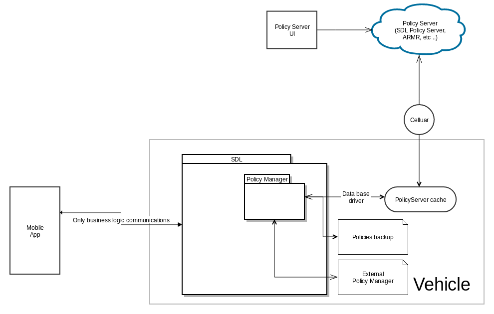
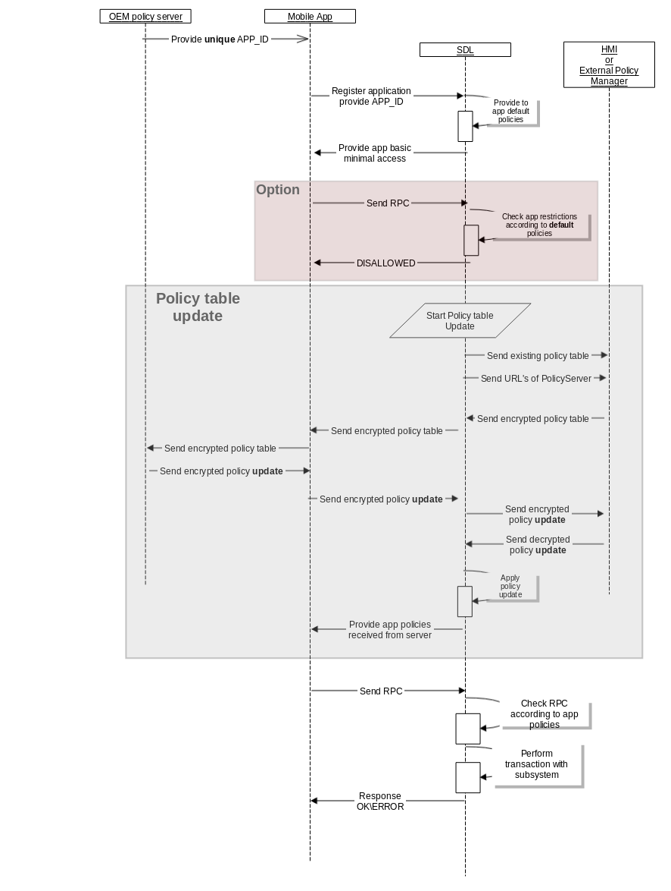
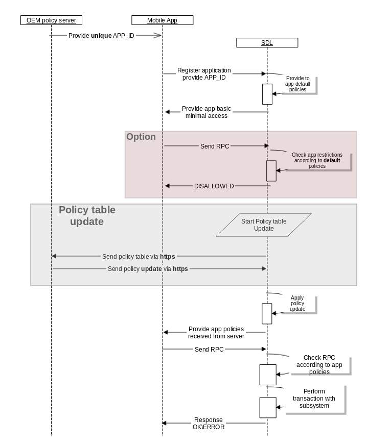

# Policy Server direct communication

* Proposal: [SDL-NNNN](nnnn-policy_server_direct_communication.md)
* Author: [Lexander Kutsan](https://github.com/LuxoftAKutsan)
* Status: **Awaiting review**
* Impacted Platforms: [Core]

## Introduction

This proposal is about communication with PolicyServer directly via vehicle celluar data, reducing of communicaitons amount and simplify policies flow. 

## Motivation

Policy update is complicated process, it requires many RPC communications and send a lot of data throw mobile chanel.
Nearest generation of headunits will have dirrect cellular connection, and communicaiton with policy server
can be done dirrectly wihtout using SDLProxy ad Mobile cellular data. 
Remove layer of abstraction in Policy table updates.
It will reduce amount of data sent via mobile transport, simplify Update Policy flow.
Also there would be no need to add additional encryption for policy table,
because there will be no intermediate actors between SDL and PolicyServer. 
The HTTPS connection would be enough.

List of improvements :
 - Reduce amount of service communications with mobile
 - Increase performance and robustness of policy update
 - Avoid additional encryptions and reduce amount of actors plaing in policy update flow
 

## Proposed solution

Create dirrect connection to Policy Server from SDL. So PolicyManager will perfrom HTTPS request for fetching Policy table updates dirrectly.

Existing approach to policy update :

Proposed approach to policy update:

## Potential downsides

Required celluar connection in vehicle.
If vehicle connection is down there is no possibility to perform policy table update.

## Impact on existing code

Impacts SDL core layers :
  - Policy Manager
  - Application Manager
  
Existing RPCs like `BasicCommunication.PolicyUpdate`, `SDL.GetURLs`, and some requests types in SystemRequest will be redundant. 

## Alternatives considered

Keep using mobile proxy for policy table update 
